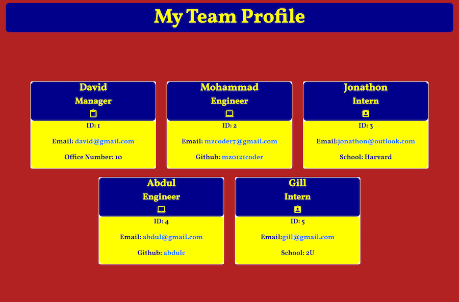

# Team-Profile-Builder 

## Live URL
https://mz0121coder.github.io/Team-Profile-Builder/

## Project Description 
This application is designed to build a visual team profile using terminal or gitbash with VS code. Created on the following user story:
```md
AS A manager
I WANT to generate a webpage that displays my team's basic info
SO THAT I have quick access to their emails and GitHub profiles
```

## Table of Contents

* [Installation](#installation)
* [Usage](#usage)
* [License](#license)
* [Credits](#credits)
* [Tests](#tests)
* [Questions](#questions)

## Installation
Clone this repository using SSH/HTML key or download ZIP. 

## Usage 
Once cloned, cd to where you have stored the folder, open index.js in integrated terminal, run node index.js and answer the questions to successfully create your team profile. You will see the results inside "dist" folder under the index.html file. 

## License
Copyright (c) [2021]
The license is MIT License. 
Read more about it at https://opensource.org/licenses/MIT.

## Credits
[Node.js](https://nodejs.org/en/)   
[Clideo](https://clideo.com/) online video editor.

## Tests
In terminal or gitbash, run the `npm test` command - use this for testing the constuctors via Jest. 

## Questions
If you have additional questions, please contact me at mzcoder7@gmail.com.  
GitHub: https://github.com/mz0121coder

## Walkthrough Video
[Creating a profile with VS code integrated terminal](./assets/Team-Profile-Builder-demo.mp4)    

## Sample profile 



